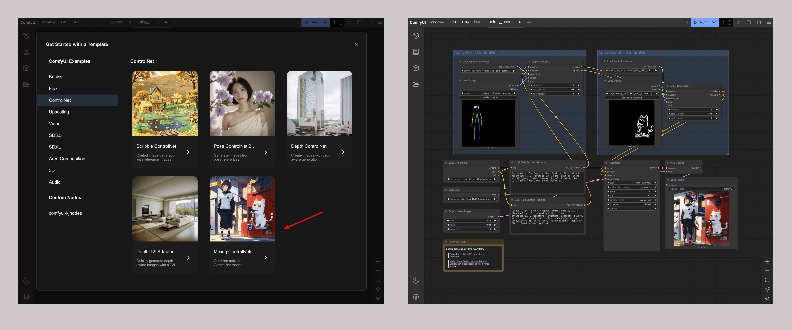
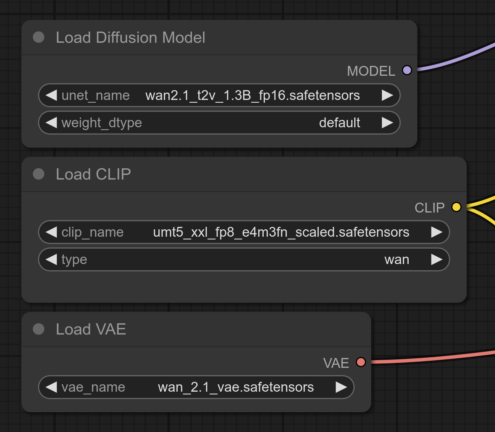
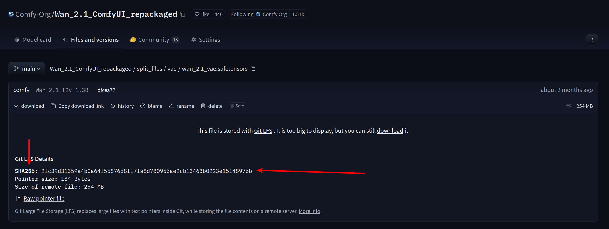
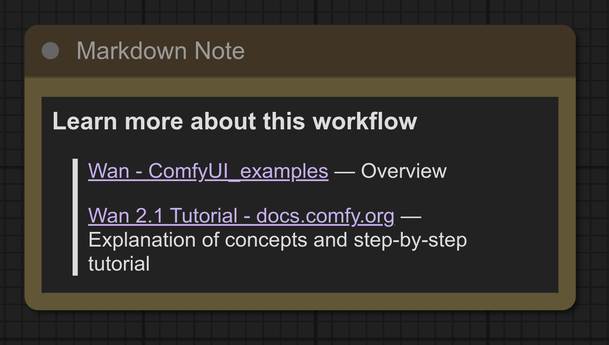

# workflow_templates

ComfyUI workflow templates available in the app by clicking the **Workflow** button then the **Browse Templates** button.

- [workflow\_templates](#workflow_templates)
  - [Adding New Templates](#adding-new-templates)
    - [1 — Find Templates Folder](#1--find-templates-folder)
    - [2 — Obtain Workflow](#2--obtain-workflow)
    - [3 — Obtain Thumbnails](#3--obtain-thumbnails)
    - [4 — Choose Thumbnail Type](#4--choose-thumbnail-type)
    - [5 — Compress Assets](#5--compress-assets)
    - [6 — Rename and Move Files](#6--rename-and-move-files)
    - [7 — Add Entry to `index.json`](#7--add-entry-to-indexjson)
    - [8 — Embed Models](#8--embed-models)
    - [9 — Embed Node Versions (optional)](#9--embed-node-versions-optional)
    - [10 — Add Documentation Nodes (optional)](#10--add-documentation-nodes-optional)
    - [11 — Bump Version and Create PR](#11--bump-version-and-create-pr)
    - [12 — Add Translations](#12--add-translations)

## Adding New Templates

I will demonstrate how to add a new template by walking through the process of adding the Wan text to video template.

### 1 — Find Templates Folder

[Set up ComfyUI_frontend dev environment](https://github.com/Comfy-Org/ComfyUI_frontend?tab=readme-ov-file#development). In the `ComfyUI_frontend/.env` file, add the line `DISABLE_TEMPLATES_PROXY=true` then start the dev server with `npm run dev`.

Copy the `templates` folder from this repository to the `ComfyUI_frontend/public` folder.

### 2 — Obtain Workflow

Either

- Create the workflow and export using `Save` => `Export`
- Use an existing workflow. To extract the workflow json from an image, you can use this tool: <https://comfyui-embedded-workflow-editor.vercel.app/>

I will get my workflow from the [ComfyUI_examples Wan 2.1 page](https://comfyanonymous.github.io/ComfyUI_examples/wan/). To get the workflow from the video on that page, I'll drag the video into [comfyui-embedded-workflow-editor](https://comfyui-embedded-workflow-editor.vercel.app/). Then I'll copy and paste it into a new json file on my computer.

> [!IMPORTANT]
>
> Make sure you start ComfyUI with `--disable-all-custom-nodes` when creating the workflow file (to prevent custom extensions adding metadata into the saved workflow file)

### 3 — Obtain Thumbnails

Ideally, the thumbnail is simply the output produced by the workflow on first execution. As an example, see the output of the [**_Mixing ControlNets_** template](https://docs.comfy.org/tutorials/controlnet/mixing-controlnets):



For my Wan 2.1 template, I'll just use [the webp video](https://comfyanonymous.github.io/ComfyUI_examples/wan/text_to_video_wan.webp) I got the workflow from.

### 4 — Choose Thumbnail Type

Choose the content type and hover effect (optional) for your thumbnail:

| Content Types                                                                                                   | Hover Effects                                                                                                                |
| --------------------------------------------------------------------------------------------------------------- | ---------------------------------------------------------------------------------------------------------------------------- |
| <br>**Image**: Default image with no extra effect | <br>**Compare Slider**: Before/after comparison tool   |
| <br>**Video**: Webp animation                        | <br>**Hover Dissolve**: Dissolves to 2nd image on hover |
| <br>**Audio**: Audio playback                      | <br>**Hover Zoom**: Same as default but zooms more             |

> [!WARNING]
>
> For video thumbnails, thumbnails need to be converted to webp format first

Since my Wan 2.1 thumbnail is already an animated video, I'll use a video thumbnail but choose not to add an effect.

### 5 — Compress Assets

Attempt to compress the assets. Since the thumbnails will never be taking up a large portion of the screen, it is acceptable to lower their size. It's also good to convert them to a space-efficient file format like webp or jpeg, applying a lossy compression algorithm (e.g., convert at 65% quality).

[EzGif](https://ezgif.com/png-to-webp) has free tools for changing resolution, compressing, and converting file types. Use whatever tool you are comfortable with.

> [!TIP]
>
> Convert to webp first, then resize to a smaller resolution. You can maintain high quality and still get near 95% reduction if e.g., converting from png.

### 6 — Rename and Move Files

Give the workflow a filename that has no spaces, dots, or special characters. Then rename the thumbnail file(s) to match, but with a counter suffix.

```
your_template_name.json
your_template_name-1.png
your_template_name-2.png
```

I'll name the Wan 2.1 template as `text_to_video_wan.json`. So my files will be:

```
text_to_video_wan.json
text_to_video_wan-1.webp
```

Then move the renamed files to your templates folder.

### 7 — Add Entry to `index.json`

There's an [`index.json`](templates/index.json) file in the templates folder which is where template configurations are set. You will need to add your template to this file, using the fields outlined below:


If your template doesn't fit into an existing category, you can add a new one:

```diff
  {
    "moduleName": "default",
    "title": "Basics",
    "type": "image",
    "templates": [
      {
        "name": "default",
        "mediaType": "image",
        "mediaSubtype": "webp",
        "description": "Generate images from text descriptions."
      },
    ]
  },
+ {
+   "moduleName": "default",
+   "title": "Your New Category"s Name",
+   "type": "video",
+   "templates": [
+     {
+       "name": "your_template_name",
+       "description": "A description of your template workflow",
+       "mediaType": "image",
+       "mediaSubtype": "webp",
+       "description": "Your template"s description.",
+       "tutorialUrl": "https://link-to-some-helpful-docs-if-they-exist.como"
+       "thumbnailVariant": "zoomHover",
+     },
+   ]
+ }
```

The Wan 2.1 template I'm adding already fits into the "Video" category, so I'll just add it there:

```diff
  {
    moduleName: "default",
    title: "Video",
    type: "video",
    templates: [
      {
        name: "ltxv_text_to_video",
        mediaType: "image",
        mediaSubtype: "webp",
        tutorialUrl: "https://comfyanonymous.github.io/ComfyUI_examples/ltxv/"
      },
+     {
+       "name": "text_to_video_wan",
+       "description": "Quickly Generate videos from text descriptions.",
+       "mediaType": "image",
+       "mediaSubtype": "webp",
+       "tutorialUrl": "https://comfyanonymous.github.io/ComfyUI_examples/wan/"
+     },
    ]
  },
```

The `thumbnailVariant` field is where you add the choice of thumbnail variant.

Now you can start ComfyUI (or refresh browser if already running) and test that your template works.

> [!WARNING]
>
> Make sure to use double-quotes `"` instead of single-quotes `'` when adding things to json files

### 8 — Embed Models

Now we need to embed metadata for any models the template workflow uses. This way, the user can download and run the workflow without ever leaving ComfyUI.

For instance, my Wan 2.1 template requires 3 models:

- umt5_xxl_fp8_e4m3fn_scaled text encoder
- wan_2.1_vae VAE
- wan2.1_t2v_1.3B_bf16 model



To add them to the workflow json, find each associated node and add the metadata to their properties:

```diff
    {
      "id": 39,
      "type": "VAELoader",
      "pos": [866.3932495117188, 499.18597412109375],
      "size": [306.36004638671875, 58],
      "flags": {},
      "order": 0,
      "mode": 0,
      "inputs": [],
      "outputs": [
        {
          "name": "VAE",
          "type": "VAE",
          "links": [76],
          "slot_index": 0
        }
      ],
      "properties": {
        "Node name for S&R": "VAELoader",
+       "models": [
+         {
+           "name": "wan_2.1_vae.safetensors",
+           "url": "https://huggingface.co/Comfy-Org/Wan_2.1_ComfyUI_repackaged/resolve/main/split_files/vae/wan_2.1_vae.safetensors?download=true",
+           "hash": "2fc39d31359a4b0a64f55876d8ff7fa8d780956ae2cb13463b0223e15148976b"
+           "hash_type": "SHA256",
+           "directory": "vae"
+         }
+       ]
      },
      "widgets_values": ["wan_2.1_vae.safetensors"]
    },
```

```diff
    {
      "id": 38,
      "type": "CLIPLoader",
      "pos": [12.94982624053955, 184.6981658935547],
      "size": [390, 82],
      "flags": {},
      "order": 1,
      "mode": 0,
      "inputs": [],
      "outputs": [
        {
          "name": "CLIP",
          "type": "CLIP",
          "links": [74, 75],
          "slot_index": 0
        }
      ],
      "properties": {
        "Node name for S&R": "CLIPLoader",
+       "models": [
+         {
+           "name": "umt5_xxl_fp8_e4m3fn_scaled.safetensors",
+           "url": "https://huggingface.co/Comfy-Org/Wan_2.1_ComfyUI_repackaged/resolve/main/split_files/text_encoders/umt5_xxl_fp8_e4m3fn_scaled.safetensors?download=true",
+           "hash": "c3355d30191f1f066b26d93fba017ae9809dce6c627dda5f6a66eaa651204f68",
+           "hash_type": "SHA256",
+           "directory": "text_encoders"
+         }
+       ]
      },
      "widgets_values": [
        "umt5_xxl_fp8_e4m3fn_scaled.safetensors",
        "wan",
        "default"
      ]
    },
```

```diff
    {
      "id": 37,
      "type": "UNETLoader",
      "pos": [485.1220397949219, 57.094566345214844],
      "size": [346.7470703125, 82],
      "flags": {},
      "order": 3,
      "mode": 0,
      "inputs": [],
      "outputs": [
        {
          "name": "MODEL",
          "type": "MODEL",
          "links": [92],
          "slot_index": 0
        }
      ],
      "properties": {
        "Node name for S&R": "UNETLoader",
+       "models": [
+         {
+           "name": "wan2.1_t2v_1.3B_bf16.safetensors",
+           "url": "https://huggingface.co/Comfy-Org/Wan_2.1_ComfyUI_repackaged/resolve/main/split_files/diffusion_models/wan2.1_t2v_1.3B_bf16.safetensors?download=true",
+           "hash": "6f999b0d6cb9a72b3d98ac386ed96f57f8cecae13994a69232514ea4974ad5fd",
+           "hash_type": "SHA256",
+           "directory": "diffusion_models"
+         }
+       ]
      },
      "widgets_values": ["wan2.1_t2v_1.3B_bf16.safetensors", "default"]
    },
```

You can find the `hash` and `hash_type` for a model on huggingface (see below)or by calculating it yourself with a script or online tool.



[Workflow spec](https://docs.comfy.org/specs/workflow_json#workflow-json) and [ModelFile Zod schema](https://github.com/Comfy-Org/ComfyUI_frontend/blob/6bc03a624ecbc0439501d0c7c2b073ca90e9a742/src/schemas/comfyWorkflowSchema.ts#L34-L40) for more details.

> [!CAUTION]
>
> Ensure that the filename being downloaded from the links matches the filenames in the `widgets_values` exactly.

### 9 — Embed Node Versions (optional)

If your template requires a specific version of Comfy or a custom node, you can specify that using the same process as with models.

The Wan 2.1 workflow requires the SaveWEBM node which wasn't fully supported until ComfyUI v0.3.26. I can add this information into the SaveWEBM node:

```diff
    {
      "id": 47,
      "type": "SaveWEBM",
      "pos": [2367.213134765625, 193.6114959716797],
      "size": [315, 130],
      "flags": {},
      "order": 9,
      "mode": 4,
      "inputs": [
        {
          "name": "images",
          "type": "IMAGE",
          "link": 93
        }
      ],
      "outputs": [],
      "properties": {
        "Node name for S&R": "SaveWEBM",
+       "cnr_id": "comfy-core",
+       "ver": "0.3.26"
      },
      "widgets_values": ["ComfyUI", "vp9", 24, 32]
    },
```

This can help diagnose issues when others run the workflow and ensure the workflow is more reproducible.

### 10 — Add Documentation Nodes (optional)

If your template corresponds with a page on https://github.com/comfyanonymous/ComfyUI_examples, https://docs.comfy.org/custom-nodes/workflow_templates, etc., you can add a `MarkdownNote` node with links:



Raw markdown used:

```markdown
### Learn more about this workflow

> [Wan - ComfyUI_examples](https://comfyanonymous.github.io/ComfyUI_examples/wan/#text-to-video) — Overview
>
> [Wan 2.1 Tutorial - docs.comfy.org](https://docs.comfy.org/tutorials/video/wan/wan-video) — Explanation of concepts and step-by-step tutorial
```

### 11 — Bump Version and Create PR

1. Fully test the workflow: delete the models, input images, etc. and try it as a new user would. Ensure the process has no hiccups and you can generate the thumbnail image on the first execution (if applicable).
2. Create a fork of https://github.com/Comfy-Org/workflow_templates (or just checkout a new branch if you are a Comfy-Org collaborator)
3. Clone the fork to your system (if not a collaborator)
4. Copy your new workflow and thumbnail(s) into the `templates` folder
5. Add your changes to the `templates/index.json` file
6. Bump the version in `pyproject.toml` ([example](https://github.com/Comfy-Org/workflow_templates/pull/32))
7. Commit and push changes
8. Create a PR on https://github.com/Comfy-Org/workflow_templates

Here is the PR I made for the Wan template: https://github.com/Comfy-Org/workflow_templates/pull/16

Once the PR is merged, if you followed step 6 correctly, a new version will be published to the [comfyui-workflow-templates PyPi package](https://pypi.org/project/comfyui-workflow-templates).

### 12 — Add Translations

Make a PR in https://github.com/Comfy-Org/ComfyUI_frontend adding the mapping from your template filename (without extension) to the English display name title. The mapping goes in [`ComfyUI_frontend/src/locales/en/main.json`](https://github.com/Comfy-Org/ComfyUI_frontend/blob/9f0abac57ba0d5752c51198bf8a075b8336fdda1/src/locales/en/main.json#L480-L487).

If you added a new category, do the same in the [categories section of the translation mappings](https://github.com/Comfy-Org/ComfyUI_frontend/blob/9f0abac57ba0d5752c51198bf8a075b8336fdda1/src/locales/en/main.json#L433).

You can edit the file and make a PR directly on the GitHub website.

Here is the PR I made for the Wan template translations: https://github.com/Comfy-Org/ComfyUI_frontend/pull/3042
