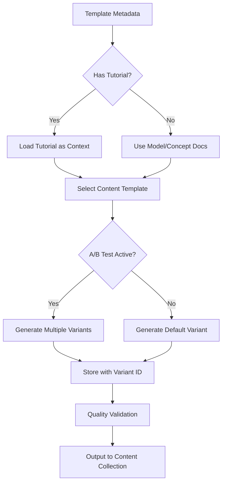

# AI Content Generation Strategy

> Comprehensive strategy for generating SEO-optimized template pages with A/B testing, multiple content formats, and quality assurance.

## Executive Summary

This document outlines the strategy for AI-generated content across the ComfyUI Template Gallery. We leverage existing high-quality tutorial content from docs.comfy.org as training examples, implement multiple content templates for A/B testing, and establish quality gates to ensure Google Helpful Content compliance.

---

## 1. Content Template Framework

### 1.1 Template Types (A/B Testing Candidates)

Based on PRD discussion and SEO research, we support four content template types:

| Template Type | Description | Target User | SEO Focus |
|---------------|-------------|-------------|-----------|
| **Tutorial** | Step-by-step guide explaining each node | Beginners, learners | "How to [task] in ComfyUI" |
| **Showcase** | Emphasizes outputs, FOMO, visual appeal | Creators, artists | "[Model] examples", "best results" |
| **Comparison** | Frames against alternatives | Researchers, evaluators | "best [task] workflow", "vs" queries |
| **Breakthrough** | Emphasizes new capabilities | Early adopters | "[Model] new features", "2024 workflow" |

### 1.2 Template Selection Logic

```typescript
interface ContentStrategy {
  templateType: 'tutorial' | 'showcase' | 'comparison' | 'breakthrough';
  
  // Selection criteria
  isNewModel: boolean;        // → breakthrough
  hasMultipleThumbnails: boolean;  // → showcase
  hasAlternatives: boolean;   // → comparison
  default: boolean;           // → tutorial
}
```

**Default Priority**: Tutorial → Showcase → Comparison → Breakthrough

For A/B testing, we can generate multiple versions and serve different variants.

---

## 2. Existing Content Assets

### 2.1 Tutorial Documentation (docs.comfy.org)

We have ~60+ existing tutorials in `/home/cbyrne/worktrees/docs/main/tutorials/`:

| Category | Count | Example Topics |
|----------|-------|----------------|
| Flux | 8 | Text-to-image, fill dev, ControlNet, Kontext |
| Wan Video | 12 | T2V, I2V, VACE, Fun Control/Camera |
| Basic | 6 | Inpaint, outpaint, upscale, img2img |
| ControlNet | 5 | Depth, pose, mixing |
| Audio | 3 | Text-to-speech, voice cloning |
| 3D | 2 | Hunyuan3D, mesh generation |

**Key Structure Pattern** (from wan-video.mdx, flux-1-fill-dev.mdx):
```markdown
---
title: ComfyUI [Model] [Task] Example
description: "This guide demonstrates how to [action] using [Model] in ComfyUI"
sidebarTitle: [Short Name]
---

## Introduction to [Model]
- Model overview (1-2 paragraphs)
- Key features (bullet list)
- Links to source (GitHub, HuggingFace)

## Model Installation
- Required files with download links
- File storage locations
- Precision options

## [Task] Workflow
### 1. Workflow File Download
- Download link/image
- "Run on Comfy Cloud" button

### 2. Complete the Workflow Step by Step
- Numbered steps with node-specific instructions
- Screenshots with annotations
- Optional customization notes

## [Additional Variants] (if applicable)
- 480P vs 720P versions
- Different model sizes
```

### 2.2 Leveraging Existing Tutorials

**Strategy**: Use existing tutorials as:
1. **Gold standard examples** for prompt engineering
2. **Knowledge base injection** for relevant templates
3. **Link targets** for "Learn more" CTAs

---

## 3. Content Generation Architecture

### 3.1 Knowledge Base Structure

```
site/knowledge/
├── prompts/
│   ├── system.md           # Base system prompt
│   ├── tutorial.md         # Tutorial template prompt
│   ├── showcase.md         # Showcase template prompt
│   ├── comparison.md       # Comparison template prompt
│   └── breakthrough.md     # Breakthrough template prompt
├── models/
│   ├── flux.md
│   ├── wan.md
│   ├── qwen.md
│   ├── sdxl.md
│   └── ... (extracted from tutorials)
├── concepts/
│   ├── inpainting.md
│   ├── outpainting.md
│   ├── controlnet.md
│   └── ...
├── examples/               # NEW: Gold standard examples
│   ├── tutorial-wan-video.md
│   ├── tutorial-flux-fill.md
│   └── ...
└── tutorials/              # NEW: Synced from docs repo
    └── [symlink or copy of docs/main/tutorials]
```

### 3.2 Generation Pipeline



### 3.3 Output Schema (Extended)

```typescript
interface GeneratedContent {
  // Existing fields
  extendedDescription: string;
  howToUse: string[];
  metaDescription: string;
  suggestedUseCases: string[];
  faqItems: Array<{ question: string; answer: string }>;
  
  // NEW: Template type tracking
  contentTemplate: 'tutorial' | 'showcase' | 'comparison' | 'breakthrough';
  
  // NEW: A/B testing
  variantId?: string;
  experimentId?: string;
  
  // NEW: Quality metrics
  qualityScore?: number;
  humanReviewStatus?: 'pending' | 'approved' | 'rejected';
  
  // NEW: Links to existing content
  tutorialUrl?: string;
  relatedTemplates?: string[];
  
  // NEW: Structured content sections
  sections?: {
    introduction?: string;
    modelOverview?: string;
    installation?: string;
    workflow?: string[];
    tips?: string[];
  };
}
```

---

## 4. Content Templates (Prompts)

### 4.1 Tutorial Template

Based on existing docs.comfy.org format:

```markdown
# Tutorial Template Prompt

Generate a step-by-step tutorial for this ComfyUI workflow template.

## Required Sections

### Extended Description (2-3 paragraphs)
- What the workflow does
- Key model/technology used
- Why users would want this

### How to Use (5-8 steps)
Format each step as:
1. [Action verb] the [component]: [brief explanation]
   - Specific values or settings if relevant

Example from our documentation:
1. Ensure the `Load Diffusion Model` node has loaded the correct model
2. Upload your input image in the `Load Image` node
3. (Optional) Modify the prompt in the `CLIP Text Encoder` node
4. Click `Queue` or use `Ctrl+Enter` to run the workflow

### FAQ Items (3-5 questions)
Use "How to..." format for Google PAA boxes:
- "How do I [specific task] with [model] in ComfyUI?"
- "What VRAM is required for [workflow]?"
- "Can I use [workflow] locally without cloud?"

### Suggested Use Cases (3-5 items)
Specific, actionable use cases:
- "Remove unwanted objects from product photography"
- "Generate consistent character turnarounds for game assets"
```

### 4.2 Showcase Template

```markdown
# Showcase Template Prompt

Generate compelling showcase content that emphasizes visual results and creative possibilities.

## Required Sections

### Extended Description
Focus on:
- Stunning output quality
- Creative possibilities
- What makes this special vs alternatives

### Visual Highlights (instead of How to Use)
- Key output features
- Quality/resolution capabilities
- Style variations possible

### Creative Applications (instead of Use Cases)
- Professional use cases (studios, agencies)
- Creative projects (artists, designers)
- Commercial applications (marketing, content)

### FAQ Items
Focus on results-oriented questions:
- "What quality can I expect from [model]?"
- "Is [workflow] suitable for professional work?"
```

### 4.3 Comparison Template

```markdown
# Comparison Template Prompt

Generate content that positions this workflow against alternatives.

## Required Sections

### Extended Description
- What problem this solves
- How it compares to manual methods or other tools
- Key differentiators

### Comparison Points
- Speed vs alternatives
- Quality vs alternatives
- Ease of use
- Cost (local vs cloud)

### When to Use This vs Alternatives
Clear guidance on best use cases

### FAQ Items
- "Is [model] better than [alternative]?"
- "When should I use [workflow] vs [other approach]?"
```

---

## 5. A/B Testing Strategy

### 5.1 Testing Framework

```typescript
interface ABExperiment {
  id: string;
  name: string;
  variants: {
    control: ContentVariant;
    treatments: ContentVariant[];
  };
  allocation: number;  // % of traffic to experiment
  metrics: string[];   // ['ctr', 'cloud_clicks', 'time_on_page']
  status: 'draft' | 'running' | 'completed';
  startDate: string;
  endDate?: string;
}

interface ContentVariant {
  id: string;
  contentTemplate: 'tutorial' | 'showcase' | 'comparison' | 'breakthrough';
  promptVersion: string;
}
```

### 5.2 Low-Effort A/B Implementation

**Phase 1: URL-based (Simplest)**
```
/templates/flux_schnell/           → Default variant
/templates/flux_schnell/?v=tutorial → Tutorial variant
/templates/flux_schnell/?v=showcase → Showcase variant
```

**Phase 2: Cookie-based (Better)**
- Assign variant on first visit
- Track with Mixpanel
- Consistent experience per user

**Phase 3: Edge-based (Production)**
- Vercel Edge Config
- A/B at CDN level
- No client-side flicker

### 5.3 Metrics to Track

| Metric | Description | Target |
|--------|-------------|--------|
| CTR (Try on Cloud) | Click-through rate on primary CTA | 3%+ |
| Time on Page | Engagement indicator | 60s+ |
| Bounce Rate | Single-page exits | <50% |
| Scroll Depth | Content consumption | >75% |
| Template Loads | Cloud usage from UTM | Track |
| SERP CTR | Search Console impressions → clicks | 5%+ |

---

## 6. Quality Assurance

### 6.1 Google Helpful Content Compliance

Based on research, ensure AI content:

1. **Adds unique value** - Not just rehashed from other sources
2. **Demonstrates expertise** - Technical accuracy, specific details
3. **Serves user intent** - Answers the actual question
4. **Has depth** - Not thin content

### 6.2 Quality Scoring

```typescript
interface QualityCheck {
  // Automated checks
  lengthCheck: boolean;      // extendedDescription > 150 words
  stepsCheck: boolean;       // howToUse.length >= 4
  faqCheck: boolean;         // faqItems.length >= 2
  keywordCheck: boolean;     // Contains model name, template title
  
  // Content quality (post-generation)
  factualAccuracy?: boolean; // Manual or AI verification
  readabilityScore?: number; // Flesch-Kincaid
  uniquenessScore?: number;  // Not duplicate of other templates
}
```

### 6.3 Human Override System

```
site/overrides/templates/
├── flux_schnell.json        # Full override
├── wan_video.json           # Partial override
└── _review_queue/           # Pending human review
    ├── template_a.json
    └── template_b.json
```

---

## 7. Implementation Roadmap

### Phase 1: Foundation (Week 1)
- [ ] Sync existing tutorials to knowledge base
- [ ] Create all 4 content template prompts
- [ ] Update generate-ai.ts for template selection
- [ ] Add quality validation step

### Phase 2: A/B Infrastructure (Week 2)
- [ ] Implement variant generation
- [ ] Add URL-based A/B routing
- [ ] Set up Mixpanel event tracking
- [ ] Create experiment dashboard

### Phase 3: Content Generation (Week 3)
- [ ] Generate tutorial variants for top 50 templates
- [ ] Generate showcase variants for visual templates
- [ ] Human review queue for quality check
- [ ] Deploy to staging

### Phase 4: Optimization (Ongoing)
- [ ] Monitor A/B test results
- [ ] Iterate on winning templates
- [ ] Expand to full catalog
- [ ] Add more knowledge base content

---

## 8. File Structure Update

```
site/
├── scripts/
│   ├── generate-ai.ts          # Updated: template selection, variants
│   ├── sync-tutorials.ts       # NEW: sync from docs repo
│   └── validate-quality.ts     # NEW: quality checks
├── knowledge/
│   ├── prompts/
│   │   ├── system.md
│   │   ├── tutorial.md         # NEW
│   │   ├── showcase.md         # NEW
│   │   ├── comparison.md       # NEW
│   │   └── breakthrough.md     # NEW
│   ├── models/                 # Expanded
│   ├── concepts/               # Expanded
│   └── examples/               # NEW: gold standard examples
├── experiments/                # NEW: A/B test configs
│   ├── active/
│   │   └── content-template-test.json
│   └── completed/
└── src/
    ├── content/templates/      # Generated content
    └── lib/
        └── ab-testing.ts       # NEW: A/B utilities
```

---

## 9. Success Metrics

| Metric | Baseline | Target (90 days) |
|--------|----------|------------------|
| Indexed pages | 0 | 50+ |
| Organic traffic | 0 | 5k/month |
| Cloud CTR | N/A | 3%+ |
| Template loads (UTM) | N/A | 500/month |
| Core Web Vitals | N/A | All passing |
| SERP rankings | N/A | Top 10 for model queries |

---

## 10. Open Questions

1. **Tutorial priority**: Should we always prefer tutorial format if a docs.comfy.org tutorial exists?
2. **Comparison scope**: How do we define "alternatives" for comparison template?
3. **A/B sample size**: How long to run tests for statistical significance?
4. **Content refresh**: How often should AI content be regenerated?

---

*Document Version: 1.0*  
*Last Updated: 2026-02-03*  
*Owner: Template Site Team*
