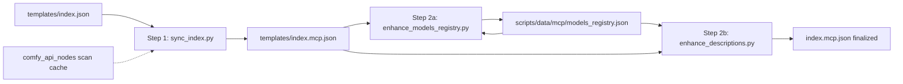

# MCP index AI enhancement workflow

Three-step pipeline for `templates/index.mcp.json`: deterministic sync first, then AI enrichment of model profiles and template descriptions.

See also [`../README.md`](../README.md) for directory layout.

## Overview



| Step | Script | Nature | Output |
|------|--------|--------|--------|
| Step 1 | `scripts/mcp/sync_index.py` | Deterministic | Template list, `capabilities` (from tags), `model`, `io`, `usage`, etc. |
| Step 2a | `scripts/mcp/enhance_models_registry.py` | AI-assisted | Model `summary`, `strengths`, `capabilities` in `models_registry.json` |
| Step 2b | `scripts/mcp/enhance_descriptions.py` | AI-assisted | Polished template `description` (references registry + category context) |

The two layers are **independent**:

- **Model layer** `models_registry.json`: `summary`, `strengths`, model-level `capabilities` (use cases / scenarios)
- **Template layer** `index.mcp.json`: per-workflow `description`, `capabilities`, `io`

## Environment setup

### 1. Copy repo-root environment file

```bash
cp .env.example .env
```

Configure in `.env`:

```env
AI_API_KEY=your-api-key
AI_BASE_URL=https://your-provider.example/v1
AI_MODEL=gpt-4o
```

`AI_BASE_URL` must be an **OpenAI-compatible** Chat Completions root (usually ends with `/v1`).

### 2. ComfyUI source path (optional, for API node scanning)

```env
COMFYUI_REPO_PATH=/path/to/ComfyUI
```

## Template cache (`template_cache.json`)

Per-template AI copy in **`scripts/data/mcp/template_cache.json`**. Model profiles stay in **`models_registry.json`**.

```json
{
  "schema_version": 1,
  "templates": {
    "template_3x3_contact_sheet": {
      "source_hash": "sha256-hex-of-templates/template_3x3_contact_sheet.json",
      "description": "...",
      "io": {
        "inputs": ["image: Subject reference", "text: Prompt"],
        "outputs": ["image: 3x3 grid"]
      }
    }
  }
}
```

**Versioning:** `source_hash` is SHA-256 of `templates/{name}.json`. When the workflow file changes, hash mismatch → `enhance_descriptions.py` targets that template on the next run. Sync/apply only merge entries with a matching hash.

| Script | Role |
|--------|------|
| `import_template_cache.py` | Seed cache from `index.mcp.json` + compute hashes |
| `sync_index.py` | Deterministic sync, merge cache when hash matches |
| `enhance_models_registry.py` | AI model profiles → `models_registry.json` |
| `enhance_descriptions.py` | AI per-template description → `template_cache.json` |
| `apply_template_cache.py` | Re-merge valid cache entries into `index.mcp.json` |

## Recommended run order

```bash
# 0. One-time: import existing AI copy into cache (if index.mcp.json already has descriptions)
python3 scripts/mcp/import_template_cache.py

# 1. Structured sync (merges template_cache when source_hash matches)
python3 scripts/mcp/sync_index.py --check
python3 scripts/mcp/sync_index.py
```

`sync_index.py` skips `model_options` for templates that contain **two or more** API nodes with a `model` dropdown. Those templates are listed in `scripts/.output/sync_index.log` (gitignored).

```bash
# 2a. AI model profiles → models_registry.json (direct)
python3 scripts/mcp/enhance_models_registry.py --check
python3 scripts/mcp/enhance_models_registry.py

# 2b. AI per-template descriptions → template_cache.json → index.mcp.json
python3 scripts/mcp/enhance_descriptions.py --check
python3 scripts/mcp/enhance_descriptions.py --category "Use Cases"
python3 scripts/mcp/enhance_descriptions.py
```

Run **2a before 2b**. After adding new templates to `index.json`, run sync then enhance — only uncached entries are sent to the AI.

## Step 2 input context

### Model profiles (`enhance_models_registry.py`)

| Source | Fields |
|--------|--------|
| Registry key | Model name |
| Existing `models_registry.json` | Current `summary`, `strengths`, `capabilities` (may be placeholder) |
| `index.mcp.json` | Up to 2 example workflows per model (light context only) |

Output: writes **`models_registry.json` directly** (not the template cache).

By default, targets models with pending/placeholder summaries or empty `capabilities`. Use `--all` to regenerate every model. Skips provider placeholders (`Google`, `Nvidia`, `Lightricks`) and `None` unless `--include-skipped`.

### Template descriptions (`enhance_descriptions.py`)

| Source | Fields |
|--------|--------|
| Current MCP entry | `name`, `title`, `task`, `model`, `capabilities`, `io`, existing `description` |
| MCP category | `category`, `category_description` (e.g. Use Cases = concrete demo workflows) |
| `models_registry.json` | Matching `model` → `summary`, `strengths`, `capabilities` |
| `index.json` | Original `description` (product copy reference) |

**Use Cases** templates use a dedicated prompt: they are purpose-built examples/effects, not general-purpose baselines. Other categories include the category description from `index.mcp.json`.

The AI should **only update** `description`. Do not change Step 1 fields such as `capabilities`, `io`, `model`, or `recommend`.

Use `--needs-update` to skip templates that already have hand-written descriptions (only auto-generated or empty).

## `freshness` label (Step 1)

Semantic string derived from `index.json` `date` (YYYY-MM-DD) at sync time (`scripts/mcp/lib/freshness_score.py`):

| Age (days since `date`) | `freshness` |
|-------------------------|-------------|
| ≤ 30 | `new` |
| 31–90 | `recent` |
| 91–180 | `current` |
| > 180 | `established` |

Missing or invalid `date` → empty string.

## `capabilities` (Step 1)

Single object describing workflow abilities and (when applicable) API model dropdown options.

```json
"capabilities": {
  "workflow": ["api", "video-edit", "lora"],
  "model_options": {
    "ByteDanceImageToVideoNode": ["seedance-1-5-pro-251215", "..."]
  }
}
```

- **`workflow`** — kebab-case feature slugs from `index.json` tags (`Video Edit` → `video-edit`, `LoRA` → `lora`, `API` → `api`). If the template has scannable API `model_options` but no `API` tag, `api` is added automatically.
- **`model_options`** — present only for templates with exactly one API node that has a `model` dropdown (verbatim option strings from ComfyUI source). Omitted when empty or when the workflow has multiple such nodes.

When neither workflow features nor model options apply, the `capabilities` field is omitted.

Raw `tags` from `index.json` are not written to `index.mcp.json`.

## `io` (Step 1)

Ordered string arrays — one slot per item, rendered inline in JSON. Format: `"type: role"`; use `type×N` when count > 1.

```json
"io": {
  "inputs": ["image: Subject reference", "text: Concept/action prompt"],
  "outputs": ["image: 3x3 variation grid", "image: Optional high-res pick"]
}
```

Types: `text`, `image`, `video`, `audio`, `model`.

**Sync behavior:** existing templates keep their `io` content (only normalized to this string format). New templates get auto-inferred defaults. `io` is not regenerated from the workflow on each run.

## `recommend` label (Step 1)

Semantic string derived from `index.json` `usage` on each sync (`scripts/mcp/lib/recommend_score.py`):

| Usage (inclusive) | `recommend` |
|-------------------|-------------|
| ≥ 2500 | `highly_recommended` |
| ≥ 1000 | `top` |
| ≥ 500 | `high` |
| ≥ 200 | `medium` |
| ≥ 50 | `low` |
| &lt; 50 | `not_recommended` |

**Category floor:** templates in **Use Cases** never sync below `low` (no `not_recommended`).

**Manual override:** `scripts/data/mcp/template_overrides.json`

```json
{
  "schema_version": 1,
  "templates": {
    "image_krea2_turbo_t2i": { "recommend": "high" },
    "template_3x3_contact_sheet": { "recommend": "top", "freshness": "current" }
  }
}
```

Overrides win over usage tiers but still respect the Use Cases floor (cannot set `not_recommended` there).

## API contract

- Protocol: OpenAI Chat Completions (`POST {AI_BASE_URL}/chat/completions`)
- Auth: `Authorization: Bearer {AI_API_KEY}`
- Model: `AI_MODEL` in `.env`
- Shared library: `scripts/lib/ai/` (`config.py`, `client.py`)

## Related files

| File | Purpose |
|------|---------|
| `.env.example` | Template for `AI_API_KEY`, `AI_BASE_URL`, `AI_MODEL`, `COMFYUI_REPO_PATH` |
| `scripts/data/mcp/template_cache.json` | Per-template AI copy (hash-versioned) |
| `scripts/data/mcp/template_cache.example.json` | Cache schema example |
| `scripts/data/mcp/models_registry.json` | Model registry |
| `scripts/lib/ai/` | Reusable OpenAI-compatible AI client |
| `scripts/mcp/sync_index.py` | Step 1 |
| `scripts/mcp/import_template_cache.py` | Seed template cache |
| `scripts/mcp/apply_template_cache.py` | Merge template cache → MCP index |
| `scripts/mcp/enhance_models_registry.py` | Step 2a (model profiles) |
| `scripts/mcp/enhance_descriptions.py` | Step 2b (template descriptions) |
| `scripts/data/mcp/models_registry.json` | Model registry (merged from cache) |
